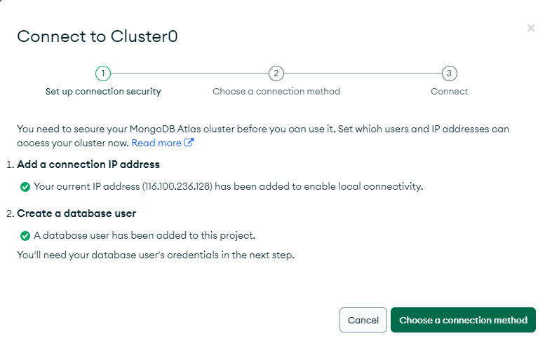
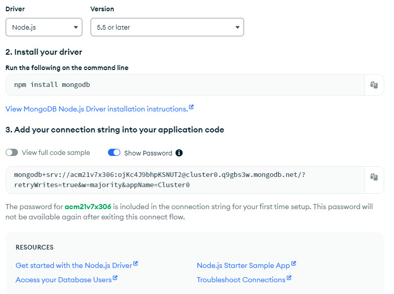

# Tiểu luận tốt nghiệp

## Đề tài: WEBSITE STUDIO NHƯ

- THỰC HIỆN: PHẠM VĂN Á
- MSSV: CM21V7X306

---

## Báo cáo và hướng dẫn chạy dự án

- [Báo cáo Tiểu luận](https://docs.google.com/document/d/1pBuecpWnVnyw-nnBTALrKOULtWCm_6oPJgoiKN2oVRI/edit?usp=sharing)
- [Xem hướng dẫn chạy dự án](huongdan.md)

## NHẬT KÝ THỰC HIỆN

**Nhật ký sẽ cập nhật theo ngày gần nhất, từ trên xuống dưới.**

### _21/3/2024 - Tìm hiểu hoạt Controller_

- [Controller là gì](https://viblo.asia/p/nodejs-bai-8-controller-LzD5dgAeljY)
- Các `controller` được lưu trong thư mục cùng tên
  - 1. orderController.js
  - 2. productController.js
  - 3. userController.js

**File:** controller/userController.js
- Thêm thư viện `express-async-handler`
- Thêm file `../models/userModel.js` 
- Thêm file `../utils/generateToken.js`
- Tạo các controller
  - 1. authUser: xác minh tài khoản
    - Lấy giá trị req.body từ client gửi lên là `email, password`
    - Đặt tên biến `user = await User.findOne({email})` giá trị tìm kiếm email trong cơ sở dữ liệu.
    - Nếu đồng thời user và mật khẩu trung khớp thì trả về json `id, name, email, isAdmin, token` ngược lại báo lỗi 401
  - 2. registerUser: đăng ký tài khoản
    - Lấy giá trị req.body từ client gửi lên là `email, password`
    - Đặt tên biến `userExists = await User.findOne({email})` kiểm tra email có tồn tại trong database không. Nếu tồn tại thì báo lỗi.
    - Đặt tên biến `user = await User.create({name,email,password,});` nếu thoả điều kiện thì trả về json `_id: user._id, name: user.name, email: user.email, token: generate(user._id), isAdmin: user.isAdmin,` ngược lại báo lỗi.
  - 3. getUserProfile: lấy thông tin thành viên
    - Đặt tên biến `const user = await User.findById(req.user._id);`
    - Nếu tồn tại user thì trả về json `_id: user._id, name: user.name, email: user.email, isAdmin: user.isAdmin,` 
    - Ngược lại báo lỗi.
  - 4. updateUserProfile: cập nhật thông tin thành viên
    - Đặt tên biến `const user = await User.findById(req.user._id);` tìm theo `id`
    - Nếu tồn tại `user` thì gán giá trị `(user.name = req.body.name || user.name)`, `(user.email = req.body.email || user.email)`. Nếu client gửi mật khẩu thì gán mật khẩu cho `user` . Cập nhật thông tin `const updatedUser = await user.save();`.Trả về cho client giá trị json `_id: updatedUser._id, name: updatedUser.name, email: updatedUser.email, isAdmin: updatedUser.isAdmin, token: generate(updatedUser._id)` ngược lại thì báo lỗi.
  - 5. getUsers: trả về thông tin tất cả thành viên
    - Đặt tên biến `const users = await User.find();`
    - Trả về kết quả `res.json(users)`
  - 6. deleteUser: xoá tài khoản người dùng. Quản trị hệ thống có quyền
    - Đặt tên biến `const user = await User.findById(req.params.id);` tìm thành viên bằng `id`
    - Nếu tìm thấy thì xoá `await user.remove();` ngược lại báo lỗi `throw new Error("User not found");`.
  - 7. getUserById: trả về thông tin của thành viên
    - Đặt tên biến `const user = await User.findById(req.params.id).select("-password");`
    - Nếu tồn tại thì trả về json `res.json(user);` ngược lại thò báo lỗi.
  - 8. updateUser: cập nhật thành viên
    - Đặt tên biến `const user = await User.findById(req.params.id);` tìm theo `id`
    - Nếu tồn tại thì cập nhật, ngược lại thì báo lỗi.

***
**File:** controller/productController.js

- Thêm thư viện `express-async-handler`
  - [Tài liệu](https://www.npmjs.com/package/express-async-handler)
  - Thư viện này xử lý đồng bộ.
- Thêm file `../models/productModel.js` sẽ tìm hiểu mục models
- Tạo các controller cho ứng dụng
  - 1. getProducts: Trả về cả sản phẩm
    - 1. **Các giá trị tính toán**
      - 1. pageSize: kích thước trang có thể chứa số sản phẩm, gán 8.
      - 2. page: trang được lấy từ số trang hoặc 1.
      - 3. keyword
      - 4. count: số sản phẩm
      - 5. products: danh sách sản phẩm trong dữ liệu    
    - 2. **Giá trị trả về cho client (res) là json**
      - 1. products: danh sách sản phẩm trong dữ liệu
      - 2. page: trang
      - 3. pages: tổng số trang
  - 2. getProductById: Trả về giá trị 1 sản phẩm theo `id`
    - 1. **Các giá trị tính toán**
      - `const product = await Product.findById(req.params.id);`
    - 2. **Giá trị trả về cho client (res)**
      - Nếu tìm thấy thì trả về kết quả `res.json(product);`
      - Ngược lại thì gán 404 cho status và tạo hàm lỗi.
  - 3. getTopProducts: Trả về sản phẩm có đánh giá cao
    - 1. **Các giá trị tính toán**
      - products: danh sách sản phẩm. Sắp xếp sản phẩm theo rating cao nhất, giới hạn 5 sản phẩm
    - 2. **Giá trị trả về cho client (res)**
      - Trả về danh sách sản phẩm theo sắp xếp và giới hạn 5.
  - 4. deleteProduct: xoá sản phẩm dành cho nhân viên quản lý, tài khoản admin
    - 1. **Các giá trị tính toán**
      - `const product = await Product.findById(req.params.id);`
    - 2. **Giá trị trả về cho client (res)**
      - Nếu tìm thấy sp thì xoá khỏi dữ liệu và thông báo đã xoá
      - Nếu không tìm thấy thì thông báo lỗi.
  - 5. createProduct: tạo sản phẩm mới dành cho nhân viên quản lý, tài khoản admin
    - 1. **Các giá trị tính toán**
    - 2. **Giá trị trả về cho client (res)**
  - 6. updateProduct: cập nhật sản phẩm
    - 1. **Các giá trị tính toán**
    - 2. **Giá trị trả về cho client (res)**
  - 7. createProductReview: tạo đánh giá sản phẩm
    - 1. **Các giá trị tính toán**
    - 2. **Giá trị trả về cho client (res)**
**Lưu ý:** Có một số controller phát triển để người dùng bình thường sử dụng, có một số controller phát triển cho đối tượng quản lý xử dụng.

---

### _21/3/2024 - Tiếp tục tìm hiểu hoạt động của rote_

**File:** routes/uploadtRoutes.js

- Sử dụng biến `path`
- Thêm thư viện express
- Thêm thư viện multer
  **(Tìm hiểu về thư viện này)**
  - 1. [Tài liệu](https://www.npmjs.com/package/multer)
  - 2. [Video hướng dẫn](https://youtu.be/huNB4wSxPqg)
  - 3. **Công dụng:** Ghi file vào thư mục đã chỉ định.
- Phương thức Router của express
- Định nghĩa biến storage.
  - 1. Dùng thư viện multer, hàm diskStorage()
  - 2. Thực hiện hàm destination(req, file, cb) với các tham số req, file, cb. Trong đó cb là hàm có 2 tham số null, upload/
  - 3. Thực hiện hàm filename(req, file, cb). Trong đó cb(null, tên file)
- Hàm kiểm tra loại file được upload
  - 1. Định nghĩa loại file
  - 2. định nghĩa extname
  - 3. định nghĩa mimetype
  - 4. Điều kiện kiểm tra tập tin. Nếu thoả đồng thời extname và mimetype thì trả về kết quả hàm cb(null,true) ngược lại trả về thông báo "Chỉ cho phép file hình ảnh"
- Định nghĩa biến upload gán bằng hàm multer() có thám số storage, fileFilter
- Định nghĩa router

| STT | Tên route | Phương thức | Middlewar              | controller | Chức năng                |
| :-- | :-------- | :---------- | :--------------------- | :--------- | :----------------------- |
| 1   | /         | POST        | upload.single("image") |            | Upload file lên ứng dụng |

---

**File:** routes/userRoutes.js

- Thêm thư viện express
- Thêm controller
- Thêm middleware
- Định nghĩa router

| STT | Tên route | Phương thức | Middlewar      | controller        | Chức năng                                  |
| :-- | :-------- | :---------- | :------------- | :---------------- | :----------------------------------------- |
| 1   | /         | POST        |                | registerUser      | Đăng ký thành viên                         |
| 2   | /         | GET         | protect, admin | getUsers          | Thông tin tài khoản                        |
| 3   | /profile  | GET         | protect        | getUserProfile    | Trả về thông tin người dùng                |
| 4   | /profile  | PUT         | protect        | updateUserProfile | Cập nhật tài khoản thành viên              |
| 5   | /:id      | GET         | protect, admin | getUserById       | Thông tin thành viên của tài khoản quản lý |
| 6   | /:id      | PUT         | protect, admin | updateUser        | Cập nhật thành viên của tài khoản quản lý  |
| 7   | /:id      | DELETE      | protect, admin | deleteUser        | Xoá thành viên của tài khoản quản lý       |

---

**File:** routes/orderRoutes.js

- Thêm thư viện express
- Thêm các `controller (addOrderItems, updateOrderToPaid, getOrderByID, getMyOrders, getOrders, updateOrderToDelivered)` từ `controller/orderController.js`
- Định nghĩa router

| STT | Tên route    | Phương thức | Middlewar      | controller             | Chức năng                       |
| :-- | :----------- | :---------- | :------------- | :--------------------- | :------------------------------ |
| 1   | /            | POST        | protect        | addOrderItems          | Thêm đặt hàng                   |
| 2   | /            | GET         | protect, admin | getOrders              | Thông tin đơn hàng              |
| 3   | myorders     | GET         | protect        | getOrderByID           | Thông tin một đơn hàng          |
| 4   | /:id/pay     | PUT         | protect        | updateOrderToPaid      | **Tìm hiểu thêm chức năng này** |
| 5   | /:id/deliver | PUT         | protect, admin | updateOrderToDelivered | **Tìm hiểu thêm chức năng này** |

---

### _20/3/2024 - Tìm hiểu hoạt động của ruote_

**File:** routes/productRoutes.js

- Thêm thư viện express
- Thêm các controller
- Thêm middleware
- Định nghĩa route

  _Định dạng bảng_

| STT | Tên route    | Phương thức | Middlewar      | controller          | Chức năng                                  |
| :-- | :----------- | :---------- | :------------- | :------------------ | :----------------------------------------- |
| 1   | /            | GET         |                | getProducts         | Trả về toàn bộ sản phẩm trong bảng dữ liệu |
| 2   | /            | POST        | protect, admin | createProduct       | Tạo mới sản phẩm                           |
| 3   | /:id/reviews | POST        | protect        | createProductReview | **Tìm hiểu thêm từ controller**            |
| 4   | /top         | GET         |                | getTopProducts      | Trả về sản phẩm có top                     |
| 5   | /:id         | GET         |                | getProductById      | Trả về 1 sản phẩm có `:id`                 |
| 6   | /:id         | DELETE      | protect, admin | deleteProduct       | Xoá sản phẩm theo `:id`                    |
| 7   | /:id         | PUT         | protect, admin | updateProduct       | Cập nhật sản phẩm theo `:id`               |

---

- 1. `router.route("/").get(getProducts)` phương thức GET lấy `controller getProducts`. Phương thức này trả về toàn bộ products của dữ liệu. Sẽ tìm hiểu phần này trong controller. url: http://localhost:5000/api/products (PORT có thể thay đổi tuỳ theo cài đặt)
- 2. `router.route("/").post(protect, admin, createProduct);` phương thức POST để tạo sản phẩm mới. Sử dụng `middleware protect, admin` và `controller createProduct`. Dùng Postman để kiểm tra
- 3. `router.route("/:id/reviews").post(protect, createProductReview);` phương thức POST, phương thức sử dụng `middleware protect`
- 4. `router.get("/top", getTopProducts);` phương thức GET lấy giá trị top từ `controller getTopProducts`. url: http://localhost:5000/api/products/top
- 5. Các route có tham số `id` của sản phẩm. Xem 1 sản phẩm của `id` đó, cập nhật hoặc xoá sản phẩm. Khi cập nhật hoặc xoá cần qua middleware.

---

**File:** routes/orderRoutes.js

- Thêm thư viện express
- Thêm các `controller (addOrderItems, updateOrderToPaid, getOrderByID, getMyOrders, getOrders, updateOrderToDelivered)` từ `controller/orderController.js`
- Định nghĩa router

---

**File:** routes/userRoutes.js

- Thêm thư viện express
- Thêm controller
- Thêm middleware
- Định nghĩa router

---

**File:** routes/uploadtRoutes.js

- Sử dụng biến `path`
- Thêm thư viện express
- Thêm thư viện multer **(Tìm hiểu về thư viện này)**
- Phương thức Router của express
- **(Tiêp tục tìm hiểu)**

---

### _20/3/2024 - Kết nối với dữ liệu MongoDB_

**File:** `config/db.js`

- Thêm thư viện mongoose.
- Thư viện được cài đặt bằng lệnh `npm i mongoose`
- [Tham khảo tại trang](https://www.npmjs.com/package/mongoose)
- Sử dụng `async\await` để kết nối MongoDB từ biến môi trường `.env`
- Xử lý ngoại lệ xác định ứng dụng có kết nối được hay không.
- Cách kết nối MongoDB với tài khoản trên MongoDB Cloud như hình

---

- **Chú ý:** Kết nối không thành công thì xem lại biến môi trường, hoặc điều chỉnh IP của Cloud MongoDB.

---

### _20/3/2024 - Tìm hiểu về biến môi trường_

- Khi sử sụng máy tính tại nhà để clone dữ liệu về thì app không chạy do lỗi biến môi trường không cập nhật được đường dẫn của MongoDB. Để nắm sâu hơn về biến môi trường tôi phải tự tìm hiểu.
- 1. Tạo file .env lưu các biến cần thiết
- 2. Cài đặt gói dotenv để chạy được biến môi trường.
- 3. Tham khảo thêm các tài liệu về dotenv
     [https://www.npmjs.com/package/dotenv]

### Tìm hiểu và cài đặt Server

_Tên file server.js_

- Cập nhật các thư viện: path, express, dotenv, color
- Thêm các file:
- Sử dụng biến môi trường
- Đặt biến `studionhu = express();`
- Tìm hiểu về thư viện `morgan`
  - 1.  Cài đặt: `npm i morgan`
  - 2.  [Tài liệu](https://www.npmjs.com/package/morgan)
  - 3.  Công cụ ghi logger request từ máy client lên server
- Các route của phần mềm
  - 1.  Sản phẩm `/api/products`
  - 2.  Người dùng `/api/users`
  - 3.  Đặt hàng `/api/orders`
  - 4.  Cập nhật `/api/upload`
  - 5.  Paypal `/api/config/paypay`?
- Tìm hiểu biến đường dẫn
  - 1. [video hướng dẫn](https://youtu.be/KBMx0ITKrGc)
  - 2. [Tài liệu](https://nodejs.org/api/path.html)
  - 3. Thực hiện các đường dẫn tĩnh của ứng dụng
- Tìm hiểu middleware
  - 1.  [Tài liệu](https://viblo.asia/p/tim-hieu-ve-middleware-trong-expressjs-gVQelwaaGZJ)
  - 2.  [video hướng dẫn](https://youtu.be/g4z5zwJMSuo)
  - 3.  Phần mềm trung gian để xử lý một vấn đề nào đó
  - 4.  Sử dụng middle lỗi được thêm ở thư mục `/middleware/errorMiddleware.js`. Trong middleware có 2 hàm notFound và errorHandler.
  - 5. `studionhu.use(notFound);` khi không tìm thấy địa chỉ
  - 6. `studionhu.use(errorHandler);`
- Ứng dụng khởi chạy sẽ lắng nghe cổng được cài đặt
  - 1.  Biến PORT giá trị cổng chạy server
  - 2.  In ra màn hình console cổng và thông báo
- Thực hiện kết nối với MongoDB bằng thư viện `mongoose`
  - 1.  Chạy hàm `connectDB();` để thực thi nội dung trong `./config/db.js`
  - 2.  Cấu hình MongoDB để kết nối với ứng dụng.

---

## _19/3/2024 - Cập nhật file_

- Tạo git respo
- Kết nối cơ sở dữ liệu, chạy backend ban đầu.
