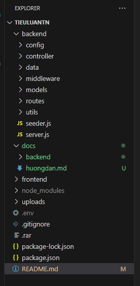

# Tiểu luận tốt nghiệp

## Đề tài: WEBSITE STUDIO NHƯ

- THỰC HIỆN: PHẠM VĂN Á
- MSSV: CM21V7X306

---

## Báo cáo và hướng dẫn chạy dự án

- [Báo cáo Tiểu luận](https://docs.google.com/document/d/1pBuecpWnVnyw-nnBTALrKOULtWCm_6oPJgoiKN2oVRI/edit?usp=sharing)
- [Xem hướng dẫn chạy dự án](./docs/huongdan.md)

## NHẬT KÝ THỰC HIỆN

**Nhật ký sẽ cập nhật theo ngày gần nhất, từ trên xuống dưới.**

### _23/3/2024_

File Reame.md khi thực hiện đã quá lớn, khó theo dõi nên tôi đã chia theo cấu trúc của dự án. Mỗi thư mục nếu cần thiết sẽ có file tài liệu ghi lại những lưu ý của thư mục, tính năng và có thể là nhật ký thực hiện.

Sắp xếp lại file tài liệu của dự án.

### _22/3/2024 Tìm hiểu model_

[Tài liệu về Models](./docs/backend/models/ReadModel.md)

***
### _22/3/2024 Tiếp tục cập nhật controller_

[Tài liệu controller](./docs/backend/controller/readController.md)
***
### _21/3/2024 - Tiếp tục tìm hiểu hoạt động của roter_

[Tài liệu router](./docs/backend/router/readRouter.md)

---
### _20/3/2024 - Kết nối với dữ liệu MongoDB_

[Tài liệu kết nối cơ sở dữ liệu MongoDB](./docs/backend/config/readConfig.md)

---

### Tìm hiểu và cài đặt Server

[Tài liệu Server](./docs/backend/readServer.md)
---
## _19/3/2024 - Cập nhật file_

- Tạo git respo
- Kết nối cơ sở dữ liệu, chạy backend ban đầu.
