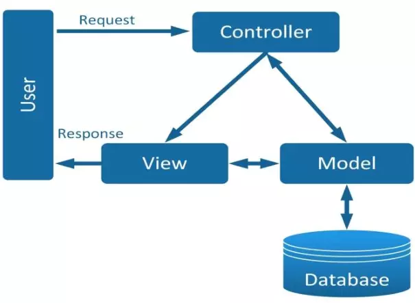
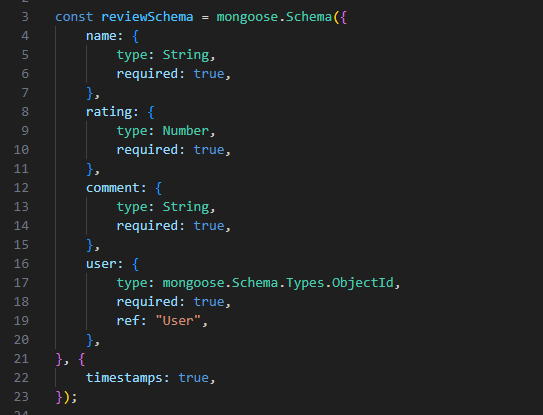

# Tài liệu của Model

1. Model là gì
   Model là một thần phần của mô hình MVC.

> Nhiệm vụ chính của thành phần này chỉ đơn giản là quản lý dữ liệu. Model sẽ chịu trách nhiệm quản lý dữ liệu từ cơ sở dữ liệu, API hay JSON.

2. Các file chứa trong Model
Trong model có 3 file `orderModel.js; productModel.js và userModel.js` lần lược sẽ tìm hiểu các chức năng.
3. Chức năng

**File:** models/orderModel.js

**File:** models/productModel.js

   - Thêm thư viện mongoose vào
   - Tạo reviewSchema có cấu trúc như sau:

**File:** models/userModel.js

4. Kết quả
