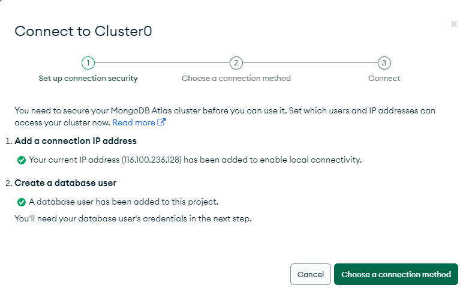
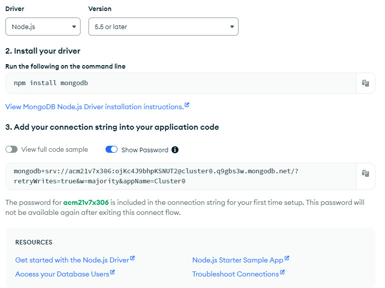

# _20/3/2024 - Kết nối với dữ liệu MongoDB_

**File:** `config/db.js`

- Thêm thư viện mongoose.
- Thư viện được cài đặt bằng lệnh `npm i mongoose`
- [Tham khảo tại trang](https://www.npmjs.com/package/mongoose)
- Sử dụng `async\await` để kết nối MongoDB từ biến môi trường `.env`
- Xử lý ngoại lệ xác định ứng dụng có kết nối được hay không.
- Cách kết nối MongoDB với tài khoản trên MongoDB Cloud như hình

---

- **Chú ý:** Kết nối không thành công thì xem lại biến môi trường, hoặc điều chỉnh IP của Cloud MongoDB.

### _20/3/2024 - Tìm hiểu về biến môi trường_

- Khi sử sụng máy tính tại nhà để clone dữ liệu về thì app không chạy do lỗi biến môi trường không cập nhật được đường dẫn của MongoDB. Để nắm sâu hơn về biến môi trường tôi phải tự tìm hiểu.
- 1. Tạo file .env lưu các biến cần thiết
- 2. Cài đặt gói dotenv để chạy được biến môi trường.
- 3. Tham khảo thêm các tài liệu về dotenv
     [https://www.npmjs.com/package/dotenv]

**Phạm Văn Á** thực hiện