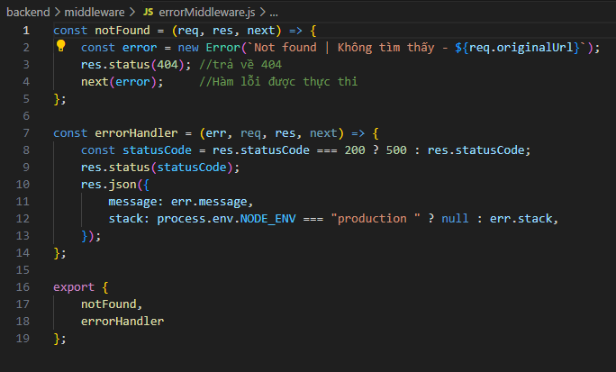
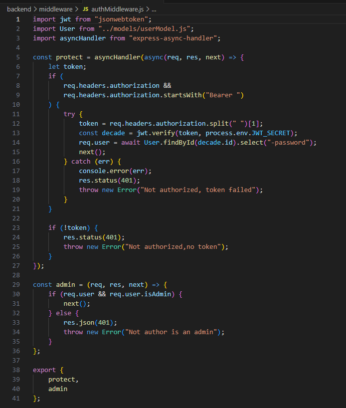

# Tài liệu Middleware

[Tài liệu READEME.MD](../../../README.md)

1. [Middleware là gì ?](https://viblo.asia/p/tong-quan-ve-middleware-ung-dung-middleware-trong-aspnet-core-RnB5pOz2lPG)

- [Tài liệu]()

2. File trong thư mục `errorMiddleware.js, authMiddleware.js`
3. Tìm hiểu tính năng

   1. `errorMiddleware.js` xử lý khi ứng dụng gặp lỗi

      

      - `notFound ` tạo hàm lỗi khi tìm không thấy route. Kết quả trả về `res.status(404);` gọi đến hàm `next(error);`.

      - `errorHandler` hàm có 4 đối số `(err, req, res, next)`. Biến được tạo `const statusCode = res.statusCode === 200 ? 500 : res.statusCode;`. Gán giá trị `res.status(statusCode);`. Trả về kết quả json `message: err.message, stack: process.env.NODE_ENV === "production " ? null : err.stack,`

   2. `authMiddleware`

      
      _25/3/2024_

   - Thêm thư viện `jwt`

   - Thêm `User` từ `models/userModel.js`
   - Tạo 2 middleware `protect, admin`

## Tìm hiểu middleware

- [Tài liệu](https://viblo.asia/p/tim-hieu-ve-middleware-trong-expressjs-gVQelwaaGZJ)`
- [video hướng dẫn](https://youtu.be/g4z5zwJMSuo)
- Phần mềm trung gian để xử lý một vấn đề nào đó

## Tìm hiểu về jwt

1. Video hướng dẫn
   [Auth: 03 - JWT là gì và những điều cần biết](https://youtu.be/o4NSbpJ4VdE)
   [JWT - Hướng dẫn code chức năng đăng ký, đăng nhập, xác thực, phân quyền ( Phần 2/3 )](https://youtu.be/NQMBEfTIO1Y)
2. Tài liệu
   [jwt.io](https://jwt.io/)
   [https://codegym.vn/blog/jwt-la-gi/](https://codegym.vn/blog/jwt-la-gi/)
   [Authorization header](https://viblo.asia/p/authorization-header-YWOZrj4wZQ0)
