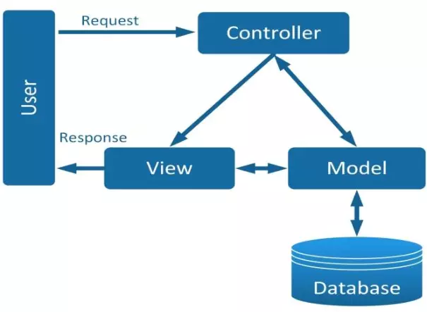
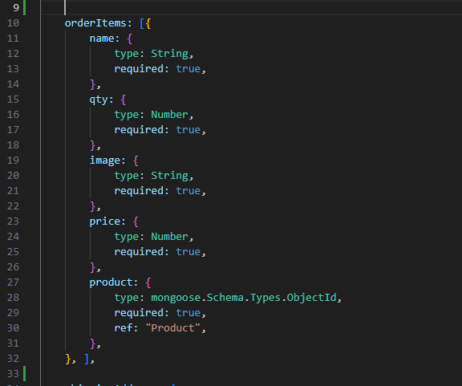
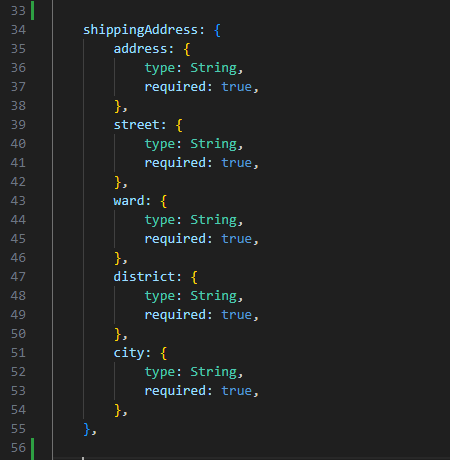
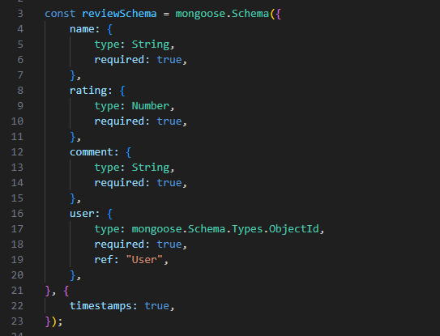
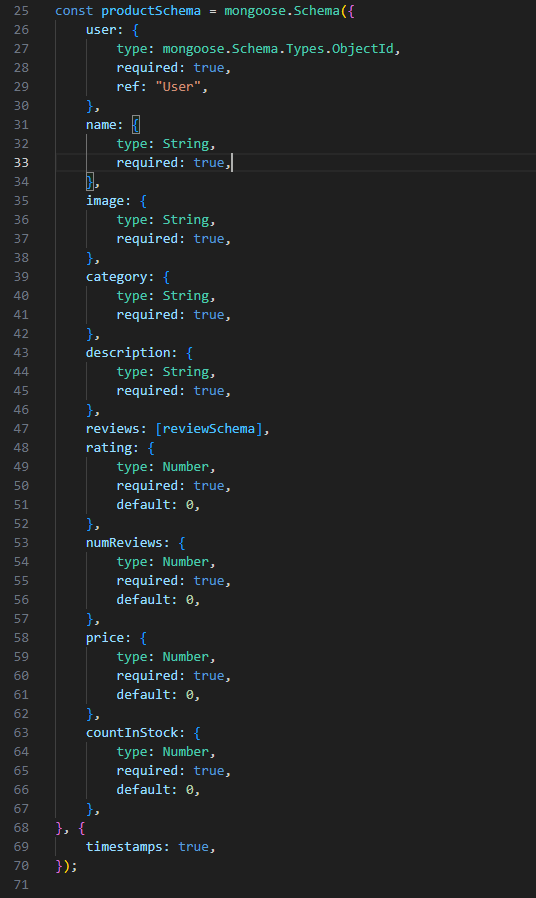
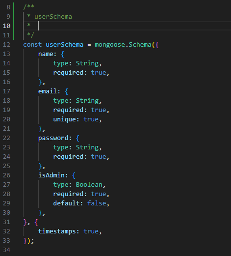
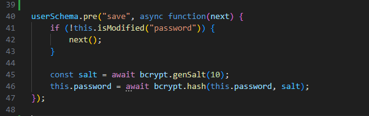

# Tài liệu của Model

   23/3/2024
1. Model là gì? 

   **Model** là một thần phần của mô hình MVC.

> Nhiệm vụ chính của thành phần này chỉ đơn giản là quản lý dữ liệu. Model sẽ chịu trách nhiệm quản lý dữ liệu từ cơ sở dữ liệu, API hay JSON.

2. Các file chứa trong Model

Trong model có 3 file:
 `orderModel.js; productModel.js và userModel.js` lần lược sẽ tìm hiểu các chức năng.

3. Cấu trúc

   **File:** models/[orderModel.js](./orderModel.js)

   - Thêm thư viện mongoose vào `import mongoose from "mongoose";`
   - orderSchema tạo `user, orderItems, shippingAddress, paymentMethod, paymentResult, taxPrice, shippingPrice, totalPrice, isPaid, paidAt, isDelivered, deliveredAt, timestamps`

   Bảng diễn giải 

| STT | Tên | Kiểu | Khoá | Bắt buộc | Diễn giải |
|:----|:----|:-----|:-----|:---------|:----------|
| 1 | user | `mongoose.Schema.Types.ObjectId` | | * | Lưu thông tin liên kết đến Tài khoản người dùng |
| 2 | orderItems | Object | `name, qty, image, price, product` | Lưu Danh sách sản phẩm đặt hàng -  Sẽ lập trường này thành bảng riêng |
| 3 | shippingAddress | Object | `address, street, ward, district, city` | Lưu thông tin địa chỉ giao hàng  - Sẽ lập bảng riêng cho trường dữ liệu này|
| 4 | paymentMethod | String | | * | Lưu phương thức thanh toán đơn hàng |
| 5 | taxPrice | Number |  | * | Lưu thông tin thuế, giá trị mặc định 0.0 |
| 6 | shippingPrice | Number | | * | Thông tin số tiền vận chuyển -  giá trị mặc định 0.0|
| 7 | totalPrice | Number | | * | Tổng tiền của đơn hàng, giá trị mặc định 0.0 |
| 8 | isPaid | Boolean | | * | Thông tin thông toán |
| 9 | paidAt | Date | | | Ngày thành toán |
| 10 | isDelivered | Boolean | | * | Vận chuyển |
| 11 | deliveredAt | Date | | | Ngày vận chuyển |
| 12 | timestamps | Datetime | | | Ngày tạo, ngày cập nhật |

Trong bảng trên có hai trường chứa dữ liệu `orderItems ` và `shippingAddress`. Giá trị tưng bảng như sau:

Bảng `orderItems `
| STT | Tên | Kiểu | Khoá | Bắt buộc | Diễn giải |
|:----|:----|:-----|:-----|:---------|:----------|
| 1 | name | String |  | * | Tên đơn hàng |
| 2 | qty | Number | |  | số lượng đơn hàng |
| 3 | image | String |  | * | Địa chỉ hình ảnh đơn hàng |
| 4 | price | Number |  | * | giá đơn hàng |
| 5 | product | `mongoose.Schema.Types.ObjectId` | | * | Thông tin sản phẩm |

Bảng `shippingAddress `

| STT | Tên | Kiểu | Khoá | Bắt buộc | Diễn giải |
|:----|:----|:-----|:-----|:---------|:----------|
| 1 | address | String | | * | Lưu địa chỉ giao hàng, số nhà |
| 2 | street | String | | * | Lưu thông tin đường |
| 3 | ward | String | | * | Lưu thông tin phường|
| 4 | district | String | | * | Lưu thông tin quận|
| 5 | city | String | | * | Lưu thông tin thành phố |

***
   **File:** models/[productModel.js](./productModel.js)

   - Thêm thư viện mongoose vào `import mongoose from "mongoose";`
   - **Tạo `reviewSchema` có cấu trúc như sau:**

   | STT | Tên | Kiểu | Khoá | Bắt buộc | Diễn giải |
   |:----|:----|:-----|:-----|:---------|:----------|
   | 1 | name | String | | * | Tên phản hồi |
   | 2 | rating | Number | | * | Điểm của phản hồi sản phẩm |
   | 3 | comment | String | | * | Nội dung phản hồi |
   | 4 | user | mongoose.Schema.Types.ObjectId | | * | Thành viên |

   - **Tạo `productSchema` có cấu trúc như sau**

   

   Bảng diễn giải **productSchema**

   | STT | Tên | Kiểu | Khoá | Bắt buộc | Diễn giải |
   |:----|:----|:-----|:-----|:---------|:----------|
   | 1 | id | Object | *| * | Chương trình tự sinh ra mã |
   | 2 | user | `mongoose.Schema.Types.ObjectId` | | * | Liên kết đến bảng `User` |
   | 3 | name | String | | * | Tên sản phẩm |
   | 4 | image | String | | * | Hình ảnh sản phẩm |
   | 5 | category | String | | * | Loại của sản phẩm |
   | 6 | description | String | | * | Diễn giải chi tiết về sản phẩm |
   | 7 | reviews | Object | reviewSchema | | Liên kết đến đối tượng `reviewSchema` đánh giá sản phẩm |
   | 8 | rating | Number | | * | Cho điểm sản phẩm, giá trị mặc định 0. |
   | 9 | numReviews | Number | | * | số lượng đánh giá, giá trị mặc định là 0 |
   | 10 | price | Number | | * | Giá của sản phẩm, mặc định là 0 |
   | 11 | countInStock | Number | | * | Số lượng trong kho, mặc định là 0 |
   | 12 | timestamps | Datetime | | | Lưu ngày được tạo và ngày cập nhật dữ liệu |

   - Tạo tên biến `const Product = mongoose.model("Product", productSchema);`
   - Biến `Product` được xuất để các thành phần khác truy xuất đến `export default Product;`
***
   **File:** models/userModel.js
   
   - Thêm thư viện mongoose vào `import mongoose from "mongoose";`
   [Tài liệu mongoose](https://www.npmjs.com/package/mongoose)
   - Thêm thư viện bcrypt vào `import bcrypt from "bcryptjs";` mã hoá mật khẩu.
   [Tài liệu bcryptjs](https://www.npmjs.com/package/bcryptjs)
   - Cấu trúc userModel như sau

   

   Bảng diễn giải **userSchema**

   | STT | Tên | Kiểu | Khoá | Bắt buộc | Diễn giải |
   |:----|:----|:-----|:-----|:---------|:----------|
   | 1 | id | Object | *| * | Chương trình tự sinh ra mã |
   | 2 | name | String |   | * | Lưu tên tài khoản người dùng| 
   | 3 | email | String |  | * | Lưu thông tin tài khoản email. Thuộc tính duy nhất |
   | 4 | password | String | | * | Lưu mật khẩu, được mã hoá `bcryptjs` |
   | 5 | isAdmin | Boolean | | * | Tài khoản thường hoặc là quản lý |

   - Mã hoá mật khẩu 
   
   `userSchema.methods.matchPassword = async function(enteredPassword) {    return await bcrypt.compare(enteredPassword, this.password);};`
   
   - Middlewarte xửa lý mật khẩu
   
   

   Xuất `user` để các thành phần khác truy xuất `const user = mongoose.model("User", userSchema);`

   > export default user;

4. Kết quả

**Phạm Văn Á** thực hiện