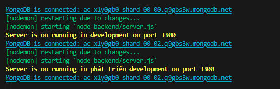

# Hướng dẫn chạy chương trình

- Thực hiện bởi: Phạm Văn Á
- Đề tài: Website Như Studio

## Tải dự án, cập nhật dự án lên Github

- lệnh để tải dự án `git clone https://github.com/phamvana/TieuluanTN.git`
- Cập nhật bằng VSCode, hoặc bằng các lênh trong terminal

## Chạy dự án

- Sau khi clone dự án, chuyển đến thư mục chứa dự án bằng lệnh `cd TieuluanTN`
- Cài đặt các gói cho dự án `npm i`
- Chạy backend `npm start`
- Kiểm tra dự án đã hoạt động chưa.

  

  Hình thông báo đã chạy được dự án
